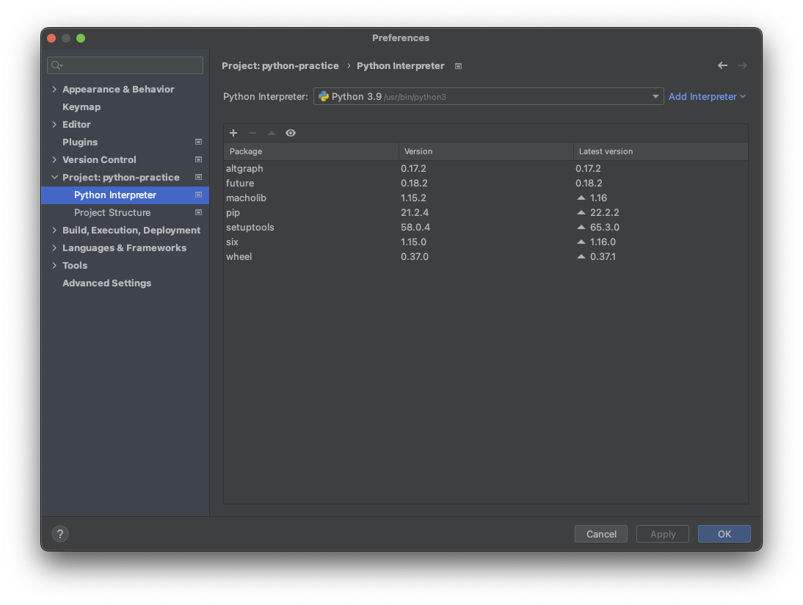
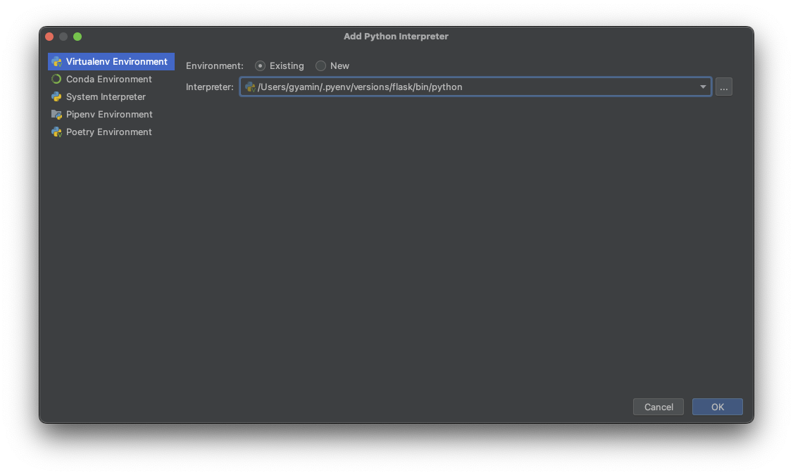
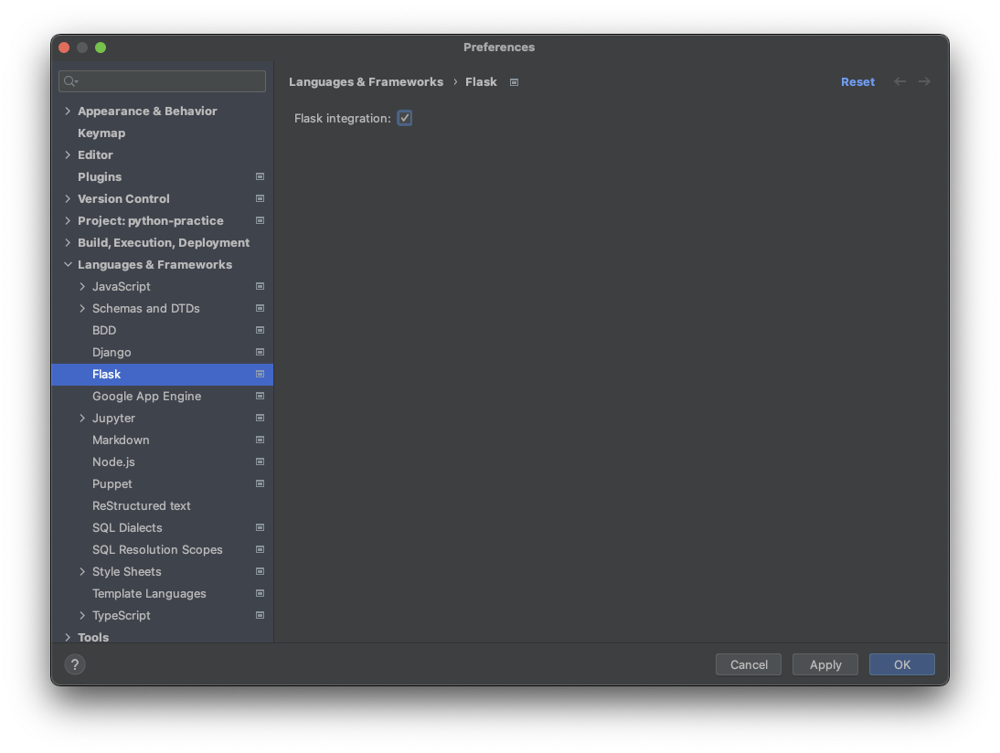

# 開発環境メモ

## セットアップ

### python環境準備(pyenv)
~/.pyenv/plugins/python-build の更新
```
% cd ~/.pyenv/plugins/python-build 
% git pull
```

pyenvでpythonインストール
```
% pyenv install 3.10.7
% pyenv local 3.10.7
% python -V
Python 3.10.7
```

virtualenvの作成
```
% git clone https://github.com/pyenv/pyenv-virtualenv.git $(pyenv root)/plugins/pyenv-virtualenv 
% pyenv virtualenv 3.10.7 flask
% pyenv virtualenvs            
  3.10.7/envs/flask (created from /Users/gyamin/.pyenv/versions/3.10.7)
  flask (created from /Users/gyamin/.pyenv/versions/3.10.7)
  
% pyenv local flask
% pyenv versions   
  system
  3.10.7
  3.10.7/envs/flask
* flask (set by /Users/gyamin/Develop/repos/python-practice/flask/.python-version)
```

Flaskのインストール
```
% pip install Flask
```

### PyCharm設定
- pythonインタープリターを準備したvirtualenv環境に設定



- Flaskサポートを有効に



### アプリケーション実行
```
% export FLASK_APP=hello
% flask run 
 * Serving Flask app 'hello'
 * Debug mode: off
 ...
```

## ライブラリの追加

```
% pip install Flask-SQLAlchemy
% pip install SQLAlchemy
% pip install python-dotenv
```